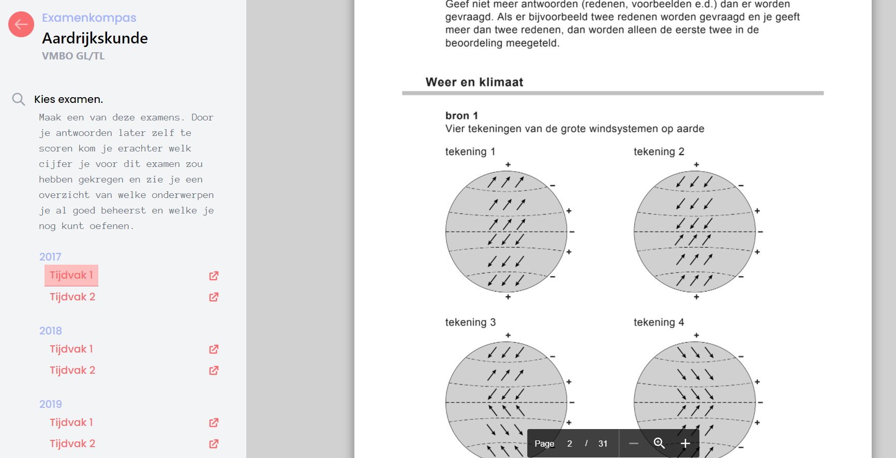
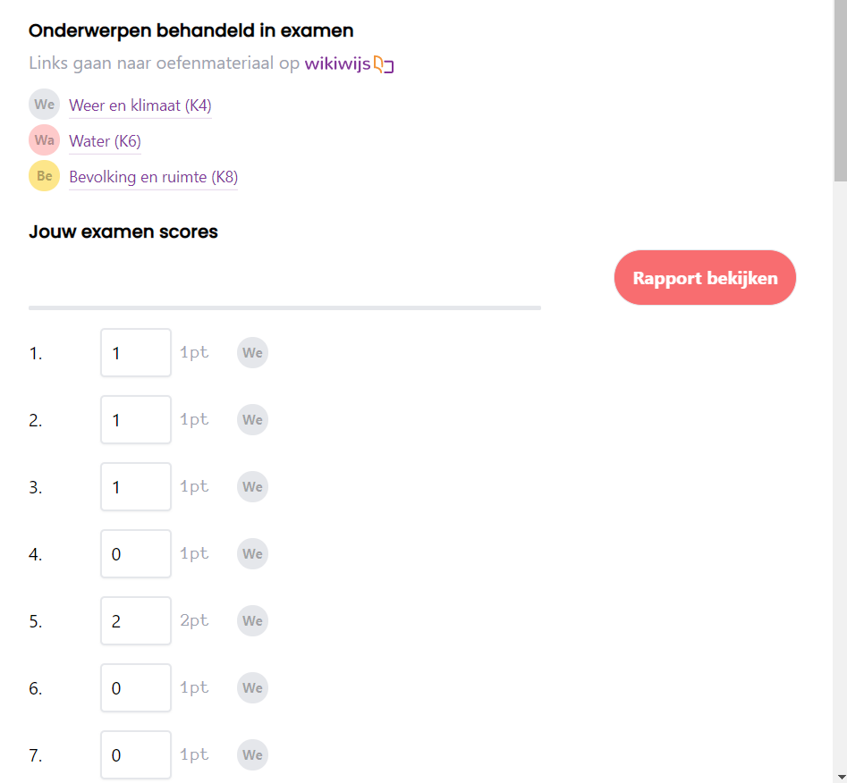
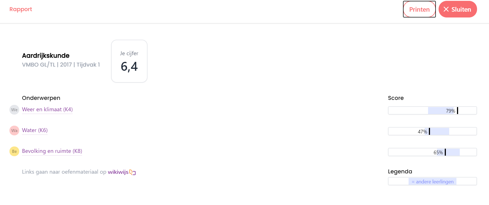

# Examenkompas

Voor meer informatie over Examenkompas klik <a href="https://www.cito.nl/kennis-en-innovatie/prototypes/projecten/examenkompas/">hier</a>.

De live versie: <a href="https://www.cito.nl/kennis-en-innovatie/prototypes/projecten/examenkompas/">https://examenkompas.citolab.nl/</a>.








## techniek

### Back end

De API is een .NET applicatie (.net5.0 in C#) en maakt gebruik van een MongoDB database. Alle statische data wordt vanuit een Excel ingelezen via de console applicatie: ```Seeder.csproj```.


### Front end.

De front end is een React applicatie met <a href="https://nx.dev/">Nx</a> tooling. De meeste componenten kunnen los van de applicatie geopend en getest worden in <a href="https://storybook.js.org/">Storybook</a>
